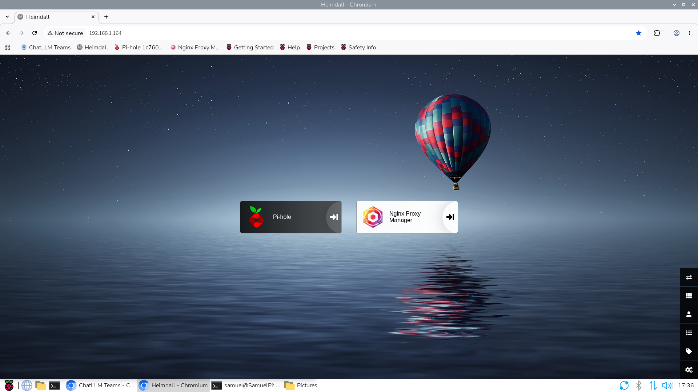
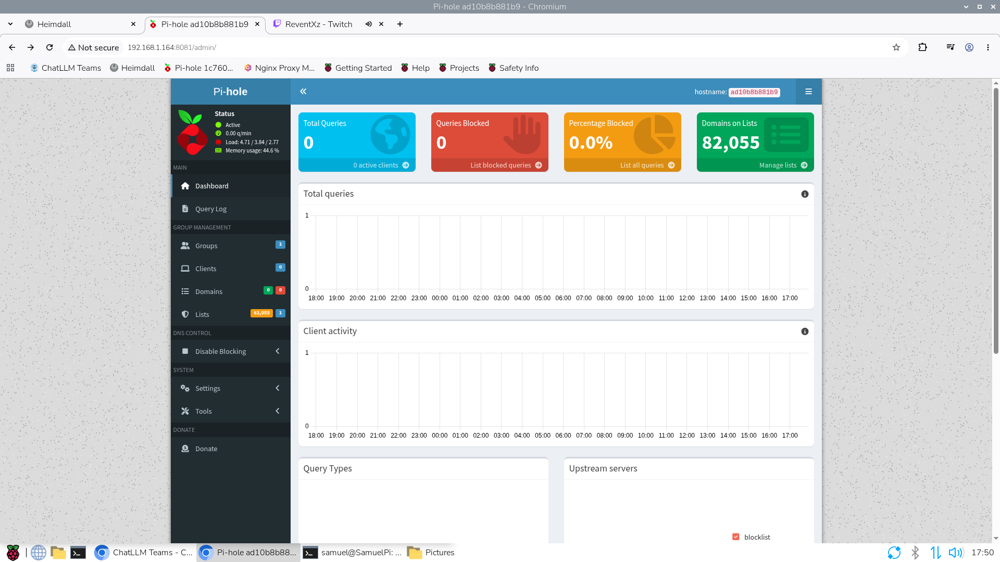
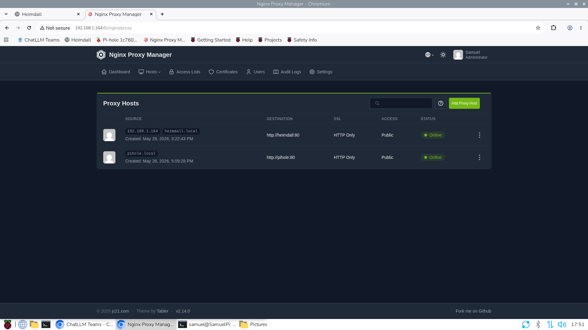
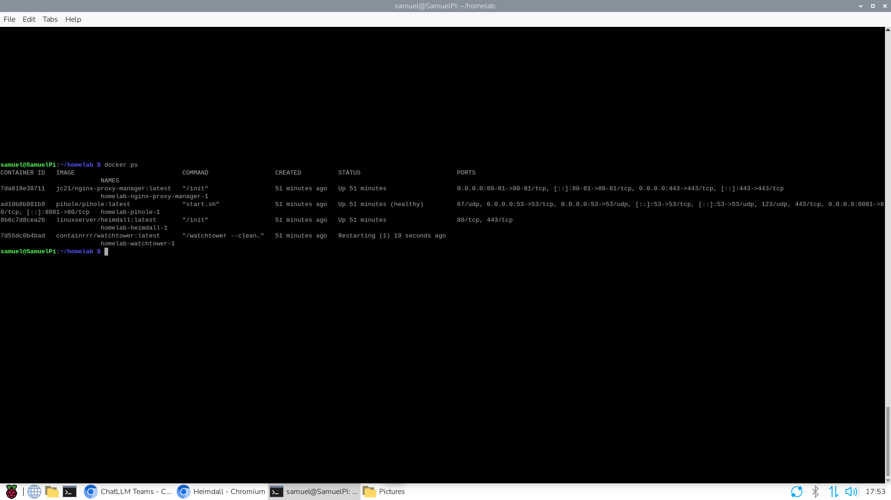

# raspberry-pi-homelab
Docker-based homelab infrastructure on Raspberry Pi with Pi-hole, Nginx Proxy Manager and Heimdall.

# Raspberry Pi Homelab Infrastructure

Ett homelab-projekt där jag byggde och driftsatte lokala IT-tjänster på en Raspberry Pi. Miljön körs i Docker-containrar och dokumenteras som en del av min portfolio för IT-LIA.

## Tekniker

- Raspberry Pi 4
- Raspberry Pi OS / Linux
- Docker
- Docker Compose
- Pi-hole
- Nginx Proxy Manager
- Heimdall
- Docker-nätverk, portar, volymer och miljövariabler

## Funktioner

- Pi-hole för DNS-baserad annonsblockering på det lokala nätverket.
- Nginx Proxy Manager för reverse proxy och åtkomst till interna webbtjänster.
- Heimdall som dashboard för tjänsterna.
- Docker Compose för att hantera och starta containrarna.
- `.env`-fil för konfigurationsvärden som inte ska delas offentligt.

## Screenshots

### Heimdall Dashboard

### Pi-hole

### Nginx Proxy Manager

### Docker-containrar

## Vad jag lärde mig

- Driftsättning av en lokal Linux-servermiljö på Raspberry Pi.
- Hantering av Docker-containrar med Docker Compose.
- Grundläggande nätverkskonfiguration, DNS och reverse proxy.
- Felsökning av containrar, rättigheter, portar, nätverk och volymer.
- Hantering av miljövariabler med `.env`.
- Dokumentation av tekniska lösningar i GitHub.

## Säkerhet

Riktiga lösenord och privata konfigurationsvärden lagras inte i repot. Använd `.env.example` som mall och skapa en egen lokal `.env`-fil.
